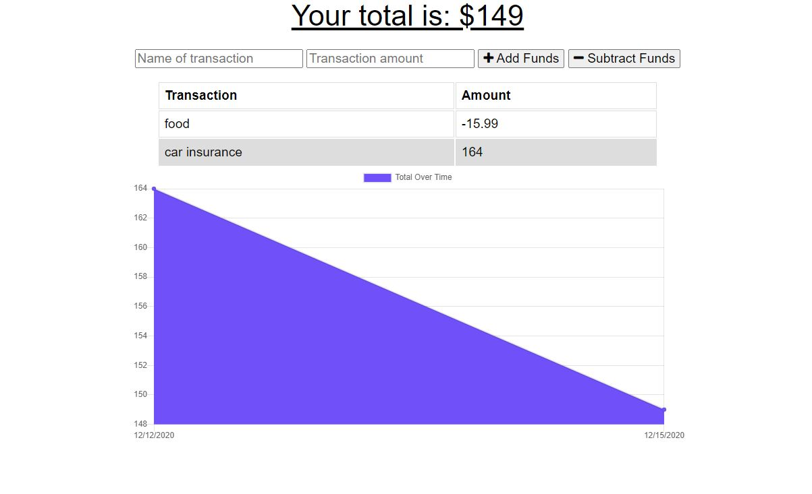

# Budget Tracker

### Deployed Application 
[Budget Tracker]()

### Description 
This application allows users to enter in a budget amount, and keep track of spending. 

When using this application, users will be able to add  transactions and keep track of their budget. They can include deposits and withdrawals. The app will then log the total overtime. 

### Features
* MongoDB 
* JavaScript    
* Utilizes NoSQL to query and route
* Service Worker
* Manifest 

### Credit
Alejandra Reyes
* areye022@gmail.com
* [GitHub](https://github.com/areye022)
* [LinkedIn](https://www.linkedin.com/in/alejandrareyes022/)

### License
Licensed under [MIT License](./LICENSE)